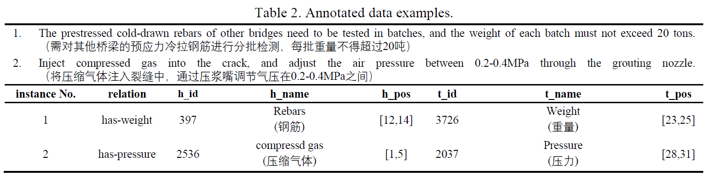
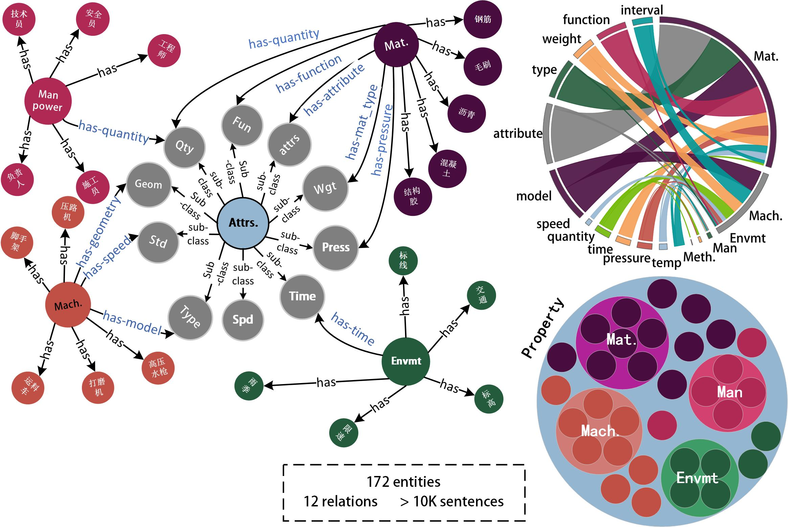

# Construction-Dataset-CONSD

## Introduction
It is an annotated dataset CONSD through the improved distantly supervised strategy Ont4RE for entity-property relation extraction in the construction industry.




More details about Ont4RE can be referred to another repo [Ontology-for-Relation-Extraction-Ont4RE](https://github.com/Construction-Material/Ontology-for-Relation-Extraction-Ont4RE-)

## Citation
If you find CONSD dataset is helpful for your research, please consider citing our paper:

```
@article{jiang2024ontology,
  title={Ontology-based distant supervision for extracting entity-property relations in construction documents},
  author={Junjie Jiang, Chengke Wu, Wenjie Sun, Yong He, Yuanjun Guo, Yang Su, Zhile Yang},
  ...
}
```
