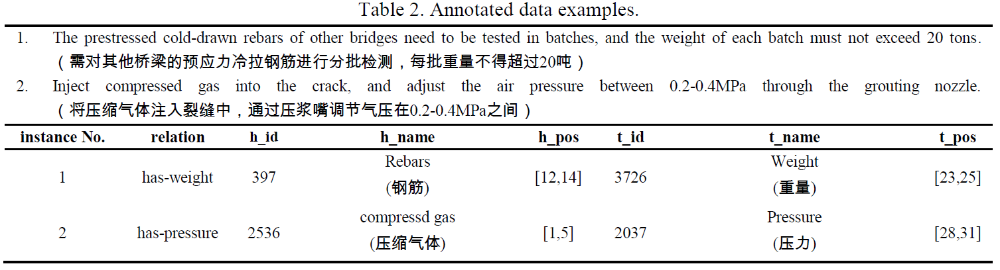

# Construction-Dataset-CONSD

## Introduction
It is an annotated dataset CONSD through the improved distantly supervised strategy Ont4RE for entity-property relation extraction in the construction industry.

More details about Ont4RE can be referred to another repo [Ontology-for-Relation-Extraction-Ont4RE](https://github.com/Construction-Material/Ontology-for-Relation-Extraction-Ont4RE-)



## Usage
- `corpus.txt` is the file containing sentence pool;
- `corpus_chinese_word_segmentation.txt` is the file containing chinese-segmented sentence pool;
- `CEMO_triples.txt` is the file containing ontological classes;
- `\CONSD` is the annotated sentences using the Ont4RE;
- `\CONSD_rule` is the annotated sentences using the traditional distantly supervised strategy.

## Citation
If you find CONSD dataset is helpful for your research, please consider giving a star and citing our paper:

```
Junjie Jiang, Chengke Wu, Wenjie Sun, Yong He, Yuanjun Guo, Yang Su, Zhile Yang. Ontology-based distant supervision for extracting entity-property relations in construction documents.
```

## Contact
Any question please contact [junj.chiang1102@gmail.com](mailto:junj.chiang1102@gmail.com).